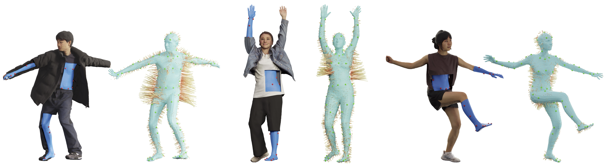

<h2 align="center"> <a href="https://arxiv.org/abs/2503.10624">ETCH: Generalizing Body Fitting to Clothed Humans via Equivariant Tightness</a>
</h2>

<h2 align="center">
🏆 ICCV 2025 Highlight Paper 🏆
</h2>

<h3 align="center">

[](https://arxiv.org/abs/2503.10624)
[](https://boqian-li.github.io/ETCH/) 
[](https://x.com/Boqian_Li_/status/1908467186122817642)
[](https://youtu.be/8_3DdW0cZqM)

[Boqian Li](https://boqian-li.github.io/), 
[Haiwen Feng](https://havenfeng.github.io/), 
[Zeyu Cai](https://github.com/zcai0612), 
[Michael J. Black](https://ps.is.mpg.de/person/black), 
[Yuliang Xiu](https://xiuyuliang.cn/) 
</h3>



This repository is the official implementation of ETCH, a novel body fitting pipeline that estimates cloth-to-body surface mapping through locally approximate SE(3) equivariance, encoding tightness as displacement vectors from the cloth to the underlying body.

## News 🚩
- [2025-08-04] We release the `All-in-One` model, which is trained on the `4D-Dress` dataset, `CAPE` dataset, and Generative dataset, totally 94501 samples. Please download the all-in-one model from [here](https://drive.google.com/drive/folders/14zGMkmC580VLNgeUBFtM6FP8QX415VAa?usp=sharing).

- [2025-08-04] We release the code for `ETCH`, please feel free to have a try!

## Overview
<div align="center">

</div>

Our key novelty is modeling cloth-to-body SE(3)-equivariant tightness vectors for clothed humans, abbreviated as ETCH, which resembles ``etching'' from the outer clothing down to the inner body. 

Following this outer-to-inner mapping, ETCH regresses sparse body markers, simplifying clothed human fitting into an inner-body marker fitting task.

## Environment Setup ⚙️

```bash
conda env create -f environment.yml
conda activate etch
cd external
git clone https://github.com/facebookresearch/theseus.git && cd theseus
pip install -e .
cd ../..
```

## Data Preparation 📃 
0. please note that we placed data samples in the `datafolder` folder for convenience. 
1. Generate Anchor Points with Tightness Vectors (for training)
    ```bash
    python scripts/generate_infopoints.py
    ```

2. Get splitted ids (pkl file)
    ```bash
    python scripts/get_splitted_ids_{datasetname}.py
    ```
3. For body_models, please download with [this link](https://drive.google.com/file/d/1JNFk4OGfDkgE9WdJb1D1zGaECix8XpKV/view?usp=sharing), and place it under the `datafolder/` folder.

4. please note that before the above processes, there are some preprocessing steps on the original data: 

    for `4D-Dress` dataset, we apply zero-translation `mesh.apply_translation(-translation)` to the original scan and the body model; 
    
    for `CAPE` dataset, we used the processed meshes extracted from [PTF](https://github.com/taconite/PTF), in which we noticed that the SMPL body meshes are marginally different from the original SMPL body meshes but more precise.

## Dataset Organization 📂
The dataset folder tree is like:  
```bash
datafolder/
├── datasetfolder/
│   ├── model/ # scans
│   │   ├── id_0
│   │   │   └── id_0.obj
│   ├── smpl(h)/ # body models
│   │   ├── id_0
│   │   │   ├── info_id_0.npz
│   │   │   └── mesh_smpl_id_0.obj # SMPL body mesh
├── useful_data_datasetname/
├── gt_datasetname_data/
│   ├── npz/
│   │   └── id_0.npz
│   └── ply 
│       └── id_0.ply
```
please refer to the `datafolder` folder for more details. 


## Training 🚀

```bash
CUDA_VISIBLE_DEVICES=0 python src/train.py --batch_size 2 --i datasetname_settingname 
# batch_size should <= num_data, if you just have the sample data, you can set batch_size to 1
```

## Evaluation 📊

```bash
CUDA_VISIBLE_DEVICES=0 python src/eval.py --batch_size 3 --model_path path_to_pretrained_model --i datasetname_settingname

# please note that the train_ids has no overlap with the val_ids, the sample data is from train_ids, so if you want to test the pretrained model on the sample data, you should set the activated_ids_path to the train_ids.pkl file for successful selection.
```

## Pretrained Model used in the paper 
Please download the pretrained model used in the paper from [here](https://drive.google.com/drive/folders/14zGMkmC580VLNgeUBFtM6FP8QX415VAa?usp=sharing). 


## 🔥 All-in-One Model 🔥
We provide the `All-in-One` model, which is trained on the `4D-Dress` dataset, `CAPE` dataset, and Generative dataset, totally 94501 samples. Please download the all-in-one model from [here](https://drive.google.com/drive/folders/14zGMkmC580VLNgeUBFtM6FP8QX415VAa?usp=sharing).

For demo inference, you can use the following command:
```bash
CUDA_VISIBLE_DEVICES=0 python src/inference_demo.py --scan_path path_to_scan_obj_file --gender gender --model_path path_to_allinone_pretrained_model
```

Please note that during the training of `All-in-One` model and in the `inference_demo.py` file, we centering the scan as input, and re-center the predicted SMPL mesh to the original scan.
For more details, please refer to the `src/inference_demo.py` file.

We also provide the animation function, which can be used to animate the scan with the predicted SMPL mesh. please refer to the `src/animation.py` file for more details.

## Citation

```bibtex
@inproceedings{li2025etch,
  title     = {{ETCH: Generalizing Body Fitting to Clothed Humans via Equivariant Tightness}},
  author    = {Li, Boqian and Feng, Haiwen and Cai, Zeyu and Black, Michael J. and Xiu, Yuliang},
  booktitle = {Proceedings of the IEEE/CVF International Conference on Computer Vision (ICCV)},
  year      = {2025}
}
```

## Acknowledgments
We thank [Marilyn Keller](https://marilynkeller.github.io/) for the help in Blender rendering, [Brent Yi](https://brentyi.github.io/) for fruitful discussions, [Ailing Zeng](https://ailingzeng.site/) and [Yiyu Zhuang](https://github.com/yiyuzhuang) for HuGe100K dataset, [Jingyi Wu](https://github.com/wjy0501) and [Xiaoben Li](https://xiaobenli00.github.io/) for their help during rebuttal and building this open-source project, and the members of [Endless AI Lab](http://endless.do/) for their help and discussions. This work is funded by the Research Center for Industries of the Future (RCIF) at Westlake University, the Westlake Education Foundation. [Yuliang Xiu](https://xiuyuliang.cn/) also received funding from the Max Planck Institute for Intelligent Systems.

Here are some great resources we benefit from:

- [ArtEq](https://github.com/HavenFeng/ArtEq) and [EPN_PointCloud](https://github.com/nintendops/EPN_PointCloud) for the Equivariant Point Network.
- [theseus](https://github.com/facebookresearch/theseus) for the implementation of Levenberg–Marquardt algorithm.
- [smplx](https://github.com/vchoutas/smplx) for the SMPL body model.
- [point-transformer](https://github.com/POSTECH-CVLab/point-transformer) for the Point Transformer network.
- [Robust Weight Transfer](https://github.com/rin-23/RobustSkinWeightsTransferCode) for SMPL-based animation.

## Contributors
Kudos to all of our amazing contributors! This open-source project is made possible by the contributions of the following individuals:

<a href="https://github.com/boqian-li/ETCH/graphs/contributors">
  
</a>

## License
ETCH is released under the [MIT License](LICENSE).

## Disclosure
While MJB is a co-founder and Chief Scientist at Meshcapade, his research in this project was performed solely at, and funded solely by, the Max Planck Society.


## Contact
For technical questions, please contact Boqian Li via boqianlihuster@gmail.com.


